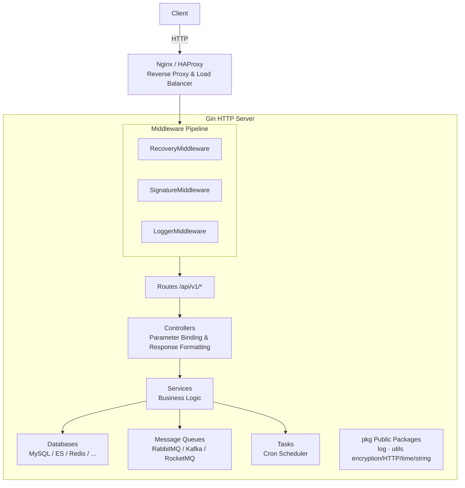
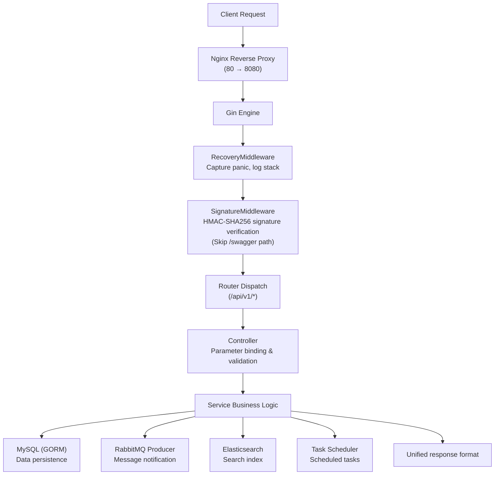
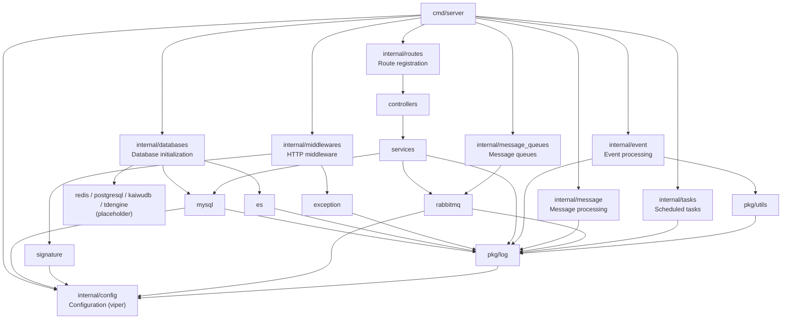

# x-HanJin (HanJin)

> A production-grade Go Web framework deeply encapsulated based on Gin framework, providing a structured, modular, and easily extensible backend service infrastructure.

## Project Overview

x-HanJin (HanJin) is a production-grade Go Web backend service framework, adopting standard Go project directory layout (cmd / pkg / internal), pre-integrated with databases, message queues, caches, logging, middleware, encryption tools, and other common components, allowing developers to quickly build business services on this foundation.

**Core Values:**

- Ready to use: Pre-configured production-grade infrastructure components
- Standard specifications: Follows Go project standard layout and best practices
- Highly modular: Clear layered architecture, easy to extend and maintain
- Enterprise-grade features: Comprehensive logging, monitoring, encryption, and containerization support

**Use Cases:**

- Small to medium enterprise Web backend services
- Independent service modules in microservice architecture
- Fast-iterating project development
- Complex business systems requiring integration of multiple data sources and message queues

## Core Features

### Production-Grade Features

- **RESTful API**: CRUD interfaces based on Gin with routing groups and API versioning
- **Swagger Documentation**: Interactive online API documentation with JSON/YAML offline export
- **Log Management**: Structured JSON logging based on Zap with date rotation, trace_id tracking, and remote push support
- **Configuration Management**: Based on Viper, supporting YAML/JSON/ENV multi-format configuration
- **Exception Recovery**: Panic capture middleware that logs stack traces to ensure stable service operation
- **Signature Verification**: HMAC-SHA256 request signature middleware preventing timing attacks for interface security

### Data Storage

- **MySQL**: ORM operations based on GORM with automatic migration support
- **Elasticsearch**: Index creation, document CRUD, batch upsert operations
- **Redis**: Cache and session storage (placeholder)
- **PostgreSQL**: Relational database support (placeholder)
- **TDengine**: Time-series database support (placeholder)

### Messaging and Events

- **RabbitMQ**: Producer/consumer pattern with queue declaration and message publish/subscribe
- **Kafka**: High-throughput message system (placeholder)
- **RocketMQ**: Distributed message system (placeholder)
- **Event Processing**: Event/message distribution framework with signature verification and decryption
- **Scheduled Tasks**: Based on robfig/cron with second-level cron expressions and periodic tasks

### Security and Encryption

- **AES Encryption**: Supports CBC/ECB/GCM modes
- **RSA Encryption**: Asymmetric encryption support
- **National Cryptography Standards**: Complete SM2/SM3/SM4 national cryptography algorithm support

### Development and Deployment

- **Local Development**: Hot reload (Air) and debug mode support
- **Container Deployment**: Docker multi-stage build with Docker Compose and Kubernetes orchestration support
- **Load Balancing**: Nginx / HAProxy reverse proxy and load balancing configuration

## Project Structure

```
x-HanJin/
├── cmd/                            # Application entry points
│   └── server/
│       └── main.go                 # Main entry: init config/logger/routes, start HTTP server
├── internal/                       # Private application code (not importable by external projects)
│   ├── config/                     # Configuration loading (viper)
│   ├── constants/                  # Application-level constants
│   ├── controllers/                # HTTP controllers (parameter binding, response formatting)
│   ├── databases/                  # Database initialization
│   │   ├── es/                     # Elasticsearch client
│   │   ├── kaiwudb/                # KaiwuDB (placeholder)
│   │   ├── mysql/                  # MySQL/GORM connection
│   │   ├── postgresql/             # PostgreSQL (placeholder)
│   │   ├── redis/                  # Redis (placeholder)
│   │   └── tdengine/               # TDengine (placeholder)
│   ├── event/                      # Event processing framework
│   ├── message/                    # Message processing framework
│   ├── message_queues/             # Message queue integration
│   │   ├── kafka/                  # Kafka (placeholder)
│   │   ├── rabbitmq/               # RabbitMQ producer/consumer
│   │   │   ├── consumer/
│   │   │   └── producer/
│   │   └── rocketmq/              # RocketMQ (placeholder)
│   ├── middlewares/                 # HTTP middleware
│   │   ├── exception_middleware.go # Panic recovery
│   │   └── signature_middleware.go # HMAC-SHA256 signature verification
│   ├── models/                     # Data models
│   │   └── user/
│   │       └── request/            # Request DTOs
│   ├── routes/                     # Route registration
│   ├── services/                   # Business logic layer
│   └── tasks/                      # Scheduled tasks
├── pkg/                            # Reusable public packages
│   ├── log/                        # Zap logger (JSON output, rotation, remote push)
│   └── utils/                      # Utility functions
│       ├── aes_util.go             # AES encryption/decryption (CBC/ECB/GCM)
│       ├── coding_util.go          # Base64/Hex encoding/decoding
│       ├── ctx_util.go             # Context value helpers
│       ├── file_util.go            # File operations
│       ├── gen_util.go             # Random generation (salt, password, IV)
│       ├── http_util.go            # HTTP client (GET/POST/upload)
│       ├── int_util.go             # Integer ternary helpers
│       ├── json_util.go            # JSON serialization/deserialization
│       ├── rsa_util.go             # RSA encryption/decryption
│       ├── sm2_util.go             # SM2 national cryptography asymmetric encryption
│       ├── sm3_util.go             # SM3 national cryptography hash
│       ├── sm4_util.go             # SM4 national cryptography symmetric encryption
│       ├── str_util.go             # String utilities
│       └── time_util.go            # Time formatting/calculation
├── scripts/                        # Build/deploy scripts
│   └── run.sh                      # Docker startup script
├── configs/                        # Configuration files
│   ├── config.yaml                 # Application config (port/DB/MQ/logger)
│   ├── nginx.conf                  # Nginx reverse proxy config
│   └── haproxy.conf                # HAProxy load balancer config
├── deploy/                         # Deployment orchestration
│   ├── docker-compose/             # Docker Compose
│   └── kubernetes/                 # Kubernetes manifests
├── docs/                           # Swagger auto-generated docs
├── statics/                        # Static assets
├── .air.toml                       # Air hot reload configuration
├── .gitignore                      # Git ignore rules
├── Dockerfile                      # Multi-stage Docker build
├── LICENSE                         # MIT License
├── README.md                       # Chinese documentation
├── README.en.md                    # English documentation
├── go.mod                          # Go module definition
└── go.sum                          # Dependency checksums
```

## System Architecture

### System Layered Architecture



### Core Function Business Flow



### Module Dependency Diagram



## Quick Start

### Environment Requirements

#### Windows

- Go 1.24+ (required; `go.mod` pinned to `go 1.24.0`)
- Git (for cloning the project)
- Configuration file: `configs/config.yaml` (needs to be filled with actual MySQL/Redis/ES/RabbitMQ addresses and credentials)
- Optional dependencies (enable as needed; services can be left unused if corresponding features are not used):
  - MySQL 5.7+ (data persistence)
  - Redis 6.0+ (cache/sessions)
  - Elasticsearch 8.x (search indexing)
  - RabbitMQ 3.8+ (async message queue)
- (Optional) Swagger documentation generation: install `swag` (`go install github.com/swaggo/swag/cmd/swag@latest`)
- (Optional) Hot reload development: install `air` (`go install github.com/cosmtrek/air@latest`)

#### Linux

- Go 1.24+ (required; `go.mod` pinned to `go 1.24.0`)
- Git (for cloning the project)
- Configuration file: `configs/config.yaml` (needs to be filled with actual MySQL/Redis/ES/RabbitMQ addresses and credentials)
- Optional dependencies (enable as needed; services can be left unused if corresponding features are not used):
  - MySQL 5.7+ (data persistence)
  - Redis 6.0+ (cache/sessions)
  - Elasticsearch 8.x (search indexing)
  - RabbitMQ 3.8+ (async message queue)
- (Optional) Swagger documentation generation: install `swag` (`go install github.com/swaggo/swag/cmd/swag@latest`)
- (Optional) Hot reload development: install `air` (`go install github.com/cosmtrek/air@latest`)

### Project Clone

```bash
git clone https://github.com/yeyushilai/x-HanJin.git
cd x-HanJin
```

### Dependency Installation

```bash
go mod tidy
```

### Configuration File

Configuration file path: `configs/config.yaml`

```yaml
# Web service configuration
Web:
  host: localhost          # Service listen address
  port: 8080               # Service listen port

# MySQL database configuration
MySQL:
  host: localhost          # Database address
  port: 3306               # Database port
  user: root               # Username
  password: your_password  # Password (change to actual value)
  default_dbname: hanjin # Default database name

# Redis cache configuration
Redis:
  host: localhost          # Redis address
  port: 6379               # Redis port
  default_db: 0            # Default database number

# Elasticsearch configuration
ES:
  address: localhost       # ES address
  user: elastic            # Username
  password: your_password  # Password (change to actual value)

# RabbitMQ message queue configuration
RabbitMQ:
  host: localhost          # RabbitMQ address
  port: 5672               # RabbitMQ port
  user: guest              # Username
  password: guest          # Password
  default_queue_name: x-hanjin-queue  # Default queue name

# Application configuration
App:
  app_id: x-HanJin         # Application ID (for signature verification)
  app_key: your_app_key    # Application key (change to actual value)

# Logger configuration
Logger:
  LogDir: "./log"          # Log directory
  Level: "info"            # Log level: debug / info / warn / error
  EnableRemote: false      # Whether to enable remote log push
  RemoteURL: ""            # Remote log service address
```

| Configuration | Description |
|---------------|-------------|
| `Web.host` / `Web.port` | Web service listen address and port |
| `MySQL.*` | MySQL connection info (host/port/user/password/dbname) |
| `Redis.*` | Redis connection info (host/port/db) |
| `ES.*` | Elasticsearch connection info (address/user/password) |
| `RabbitMQ.*` | RabbitMQ connection info (host/port/user/password/queue) |
| `App.app_id` / `App.app_key` | Application identity and HMAC signing key |
| `Logger.*` | Logger configuration (directory/level/remote push) |

### Service Startup

#### Method 1: Local Development Mode (Hot Reload and Debug Mode Support)

```bash
# 1. Modify configuration (replace sensitive values like passwords with actual values)
# Edit configs/config.yaml

# 2. Install air hot reload tool (if not already installed)
go install github.com/air-verse/air@latest

# 3. Start service with air (supports hot reload)
air

# 4. Or start with debug mode
# Windows
set GIN_MODE=debug
go run ./cmd/server/

# Linux / macOS
export GIN_MODE=debug
go run ./cmd/server/

# 5. Build and start
go build -o server ./cmd/server/
./server
```

After service startup, access:
- API Service: `http://localhost:8080`
- Swagger Documentation: `http://localhost:8080/swagger/index.html`

#### Method 2: Docker Container Deployment

```bash
# Single container startup
docker build -t x-hanjin .
docker run -p 8080:8080 --name x-hanjin x-hanjin

# Docker Compose (includes MySQL + Redis + RabbitMQ)
cd deploy/docker-compose

# Basic services (without Elasticsearch)
docker-compose up -d

# Full services (includes Elasticsearch)
docker-compose --profile full up -d

# View service status
docker-compose ps

# View logs
docker-compose logs -f x-hanjin

# Stop services
docker-compose down

# Stop and delete data volumes
docker-compose down -v

# Kubernetes
kubectl apply -f deploy/kubernetes/test-gin.yaml
```

### Common Commands

```bash
# Build
go build -o server ./cmd/server/

# Run
go run ./cmd/server/

# Hot reload development
air

# Format code
go fmt ./...

# Static code check
go vet ./...

# Run tests
go test ./...

# Install dependencies
go mod tidy

# Generate Swagger documentation
swag init -g cmd/server/main.go -o docs/

# Docker build
docker build -t x-hanjin .

# Docker Compose startup
docker-compose -f deploy/docker-compose/docker-compose.yaml up -d
```

## Technology Stack

### Web Framework

- [Gin](https://github.com/gin-gonic/gin) - High-performance HTTP framework

### Data Storage

- [GORM](https://gorm.io) - Go language ORM library
- MySQL - Main data storage
- Elasticsearch - Search engine
- Redis - Cache and session storage
- PostgreSQL - Relational database (placeholder)

### Message Queues

- RabbitMQ - Async messaging
- Kafka - High-throughput message system (placeholder)
- RocketMQ - Distributed message system (placeholder)

### Tool Libraries

- [Viper](https://github.com/spf13/viper) - Configuration management, supports YAML/JSON/ENV multi-format
- [Zap](https://github.com/uber-go/zap) + [Lumberjack](https://github.com/natefinch/lumberjack) - Structured JSON logging + file rotation
- [robfig/cron](https://github.com/robfig/cron) - Scheduled tasks with second-level precision
- [Swaggo](https://github.com/swaggo/swag) - Swagger auto-generation

### Encryption and Security

- AES / RSA - Common encryption algorithms
- [SM2-SM4](https://github.com/tjfoc/gmsm) - National cryptography algorithms

### Deployment Tools

- Docker - Containerization
- Docker Compose - Multi-container orchestration
- Kubernetes - Container orchestration
- Nginx / HAProxy - Reverse proxy and load balancing

## API Documentation

The project integrates Swagger auto-generated API documentation with online interactive and offline export support.

- **Swagger UI Interactive Documentation**: http://localhost:8080/swagger/index.html
- **ReDoc Read-Only Documentation**: http://localhost:8080/swagger/doc.html
- **OpenAPI JSON Documentation**: http://localhost:8080/swagger/doc.json

Generate documentation command:

```bash
swag init -g cmd/server/main.go -o docs/
```

## Storage Configuration

### Local Storage

Local storage configuration is located in `configs/config.yaml`, mainly including:
- MySQL database connection configuration
- Redis cache configuration
- Elasticsearch search engine configuration

### Object Storage

Object storage functionality (such as Alibaba Cloud OSS, AWS S3, etc.) is currently a reserved module and can be extended and integrated according to business needs.

## License

This project is licensed under the [MIT License](LICENSE).

## References

- [Gin Framework Documentation](https://gin-gonic.com/docs/)
- [GORM Documentation](https://gorm.io/docs/)
- [Viper Configuration Management](https://github.com/spf13/viper)
- [Zap Logging Library](https://pkg.go.dev/go.uber.org/zap)
- [Go Project Standard Layout](https://github.com/golang-standards/project-layout)
- [Swaggo Swagger Generation](https://github.com/swaggo/swag)
- [Air Hot Reload Tool](https://github.com/cosmtrek/air)
- [Docker Official Documentation](https://docs.docker.com/)
- [Docker Compose Documentation](https://docs.docker.com/compose/)
- [Kubernetes Documentation](https://kubernetes.io/docs/)

## Contact

- **Author**: John Young (Online nickname: 夜雨诗来)
- **Email**: [john.young@foxmail.com](mailto:john.young@foxmail.com)
- **Gitee**: [https://gitee.com/yeyushilai](https://gitee.com/yeyushilai)
- **GitHub**: [https://github.com/yeyushilai](https://github.com/yeyushilai)
