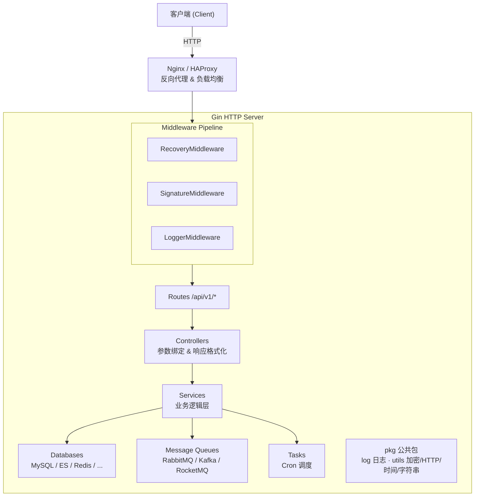
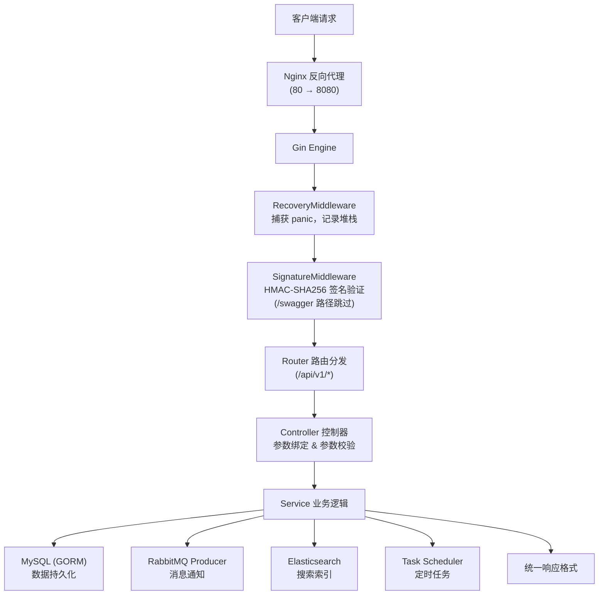
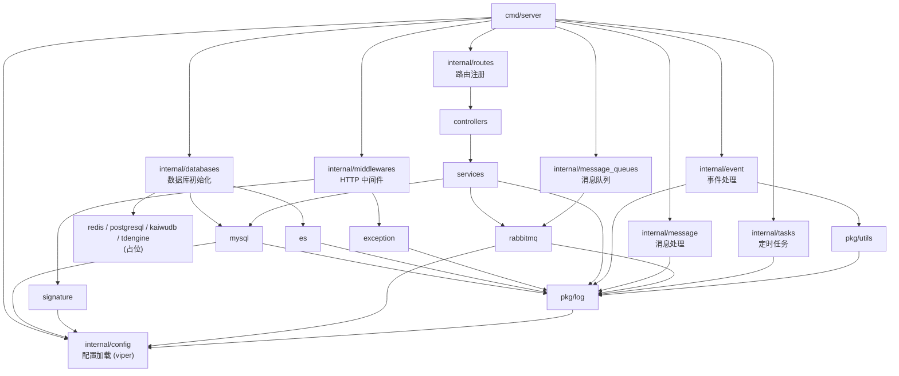

# x-HanJin (汉津)

> 一个基于 Gin 框架深度封装的生产级 Go Web 项目框架

## 项目简介

x-HanJin（汉津）是一个基于 Gin 框架深度封装的生产级 Go Web 项目框架，采用标准的 Go 项目目录布局（cmd / pkg / internal），预集成数据库、消息队列、缓存、日志、中间件、加密工具等常用组件，开发者可在此基础上快速构建业务服务。

**核心价值**：
- 开箱即用：预置生产级基础组件，开箱即用
- 标准规范：遵循 Go 项目标准布局和最佳实践
- 高度模块化：清晰的分层架构，易于扩展和维护
- 企业级特性：完善的日志、监控、加密、容器化支持

**适用场景**：
- 中小型企业级 Web 后端服务
- 微服务架构中的独立服务模块
- 需要快速迭代的项目开发
- 需要集成多种数据源和消息队列的复杂业务系统

## 核心特征

### 生产级特性

- **RESTful API**：基于 Gin 的 CRUD 接口，支持路由分组和 API 版本管理
- **Swagger 文档**：在线交互式 API 文档，支持 JSON/YAML 离线导出
- **日志管理**：基于 zap 的结构化 JSON 日志，按日期轮转，支持 trace_id 追踪和远程推送
- **配置管理**：基于 viper，支持 YAML/JSON/ENV 多格式配置
- **异常恢复**：Panic 捕获中间件，记录堆栈信息，确保服务稳定运行
- **签名验证**：HMAC-SHA256 请求签名中间件，防时序攻击，保障接口安全

### 数据存储

- **MySQL**：基于 GORM 的 ORM 操作，支持自动迁移
- **Elasticsearch**：索引创建、文档 CRUD、批量 upsert 操作
- **Redis**：缓存和会话存储（占位）
- **PostgreSQL**：关系型数据库支持（占位）
- **TDengine**：时序数据库支持（占位）

### 消息与事件

- **RabbitMQ**：生产者/消费者模式，支持队列声明和消息发布/订阅
- **Kafka**：高吞吐量消息系统（占位）
- **RocketMQ**：分布式消息系统（占位）
- **事件处理**：基于签名验证和解密的事件/消息分发框架
- **定时任务**：基于 robfig/cron，支持秒级 cron 表达式和周期任务

### 安全与加密

- **AES 加密**：支持 CBC/ECB/GCM 多种模式
- **RSA 加密**：非对称加密支持
- **国密算法**：SM2/SM3/SM4 国密算法完整支持

### 开发与部署

- **本地开发**：支持热重载（Air）和调试模式
- **容器化部署**：Docker 多阶段构建，支持 Docker Compose 与 Kubernetes 编排
- **负载均衡**：Nginx / HAProxy 反向代理和负载均衡配置

## 项目结构

```
x-HanJin/
├── cmd/                            # 程序入口
│   └── server/
│       └── main.go                 # 主入口，初始化配置/日志/路由，启动 HTTP 服务
├── internal/                       # 私有应用代码（不可被外部项目导入）
│   ├── config/                     # 配置加载与管理（viper）
│   ├── constants/                  # 应用级常量定义
│   ├── controllers/                # HTTP 控制器层（参数绑定、响应格式化）
│   ├── databases/                  # 数据库初始化
│   │   ├── es/                     # Elasticsearch 客户端封装
│   │   ├── kaiwudb/                # KaiwuDB（占位）
│   │   ├── mysql/                  # MySQL/GORM 连接管理
│   │   ├── postgresql/             # PostgreSQL（占位）
│   │   ├── redis/                  # Redis（占位）
│   │   └── tdengine/               # TDengine（占位）
│   ├── event/                      # 事件处理框架（验签、解密、分发）
│   ├── message/                    # 消息处理框架（多终端推送）
│   ├── message_queues/             # 消息队列集成
│   │   ├── kafka/                  # Kafka（占位）
│   │   ├── rabbitmq/               # RabbitMQ 生产者/消费者
│   │   │   ├── consumer/
│   │   │   └── producer/
│   │   └── rocketmq/              # RocketMQ（占位）
│   ├── middlewares/                 # HTTP 中间件
│   │   ├── exception_middleware.go # 异常恢复（panic 捕获）
│   │   └── signature_middleware.go # HMAC-SHA256 签名验证
│   ├── models/                     # 数据模型
│   │   └── user/
│   │       └── request/            # 请求 DTO
│   ├── routes/                     # 路由注册
│   ├── services/                   # 业务逻辑层
│   └── tasks/                      # 定时任务调度
├── pkg/                            # 可复用的公共包（可被外部项目导入）
│   ├── log/                        # zap 日志模块（JSON输出、轮转、远程推送）
│   └── utils/                      # 工具函数集
│       ├── aes_util.go             # AES 加密/解密（CBC/ECB/GCM）
│       ├── coding_util.go          # Base64/Hex 编解码
│       ├── ctx_util.go             # 上下文值读写
│       ├── file_util.go            # 文件操作
│       ├── gen_util.go             # 随机生成（盐值、密码、IV）
│       ├── http_util.go            # HTTP 客户端（GET/POST/上传）
│       ├── int_util.go             # 整数三元表达式
│       ├── json_util.go            # JSON 序列化/反序列化
│       ├── rsa_util.go             # RSA 加密/解密
│       ├── sm2_util.go             # SM2 国密非对称加密
│       ├── sm3_util.go             # SM3 国密哈希
│       ├── sm4_util.go             # SM4 国密对称加密
│       ├── str_util.go             # 字符串工具
│       └── time_util.go            # 时间格式化/计算
├── scripts/                        # 构建/部署脚本
│   └── run.sh                      # Docker 启动脚本
├── configs/                        # 配置文件
│   ├── config.yaml                 # 应用配置（端口/数据库/MQ/日志）
│   ├── nginx.conf                  # Nginx 反向代理配置
│   └── haproxy.conf                # HAProxy 负载均衡配置
├── deploy/                         # 部署编排
│   ├── docker-compose/             # Docker Compose
│   └── kubernetes/                 # Kubernetes manifests
├── docs/                           # Swagger 自动生成文档
├── statics/                        # 静态资源
├── .air.toml                       # Air 热重载配置
├── .gitignore                      # Git 忽略规则
├── Dockerfile                      # 多阶段 Docker 构建
├── LICENSE                         # MIT 许可证
├── README.md                       # 中文文档
├── README.en.md                    # 英文文档
├── go.mod                          # Go 模块定义
└── go.sum                          # 依赖校验
```

## 系统架构

### 系统分层架构图



### 核心功能业务流程图



### 模块依赖关系图



## 快速开始

### 环境要求

#### Windows
- Go 1.24+（必需；`go.mod` 已固定为 `go 1.24.0`）
- Git（用于克隆项目）
- 配置文件：`configs/config.yaml`（需要根据实际情况填写 MySQL / Redis / ES / RabbitMQ 的地址与账号密码）
- 可选依赖（按功能启用；不使用对应能力即可不拉起服务）：
  - MySQL 5.7+（数据持久化）
  - Redis 6.0+（缓存/会话）
  - Elasticsearch 8.x（搜索索引）
  - RabbitMQ 3.8+（异步消息队列）
- （可选）Swagger 文档生成：安装 `swag`（`go install github.com/swaggo/swag/cmd/swag@latest`）
- （可选）热重载开发：安装 `air`（`go install github.com/cosmtrek/air@latest`）

#### Linux
- Go 1.24+（必需；`go.mod` 已固定为 `go 1.24.0`）
- Git（用于克隆项目）
- 配置文件：`configs/config.yaml`（需要根据实际情况填写 MySQL / Redis / ES / RabbitMQ 的地址与账号密码）
- 可选依赖（按功能启用；不使用对应能力即可不拉起服务）：
  - MySQL 5.7+（数据持久化）
  - Redis 6.0+（缓存/会话）
  - Elasticsearch 8.x（搜索索引）
  - RabbitMQ 3.8+（异步消息队列）
- （可选）Swagger 文档生成：安装 `swag`（`go install github.com/swaggo/swag/cmd/swag@latest`）
- （可选）热重载开发：安装 `air`（`go install github.com/cosmtrek/air@latest`）

### 项目克隆

```bash
git clone https://gitee.com/cross-lang/x-HanJin.git
cd x-HanJin
```

### 依赖安装

```bash
go mod tidy
```

### 配置文件

配置文件路径：`configs/config.yaml`

```yaml
# Web 服务配置
Web:
  host: localhost          # 服务监听地址
  port: 8080               # 服务监听端口

# MySQL 数据库配置
MySQL:
  host: localhost          # 数据库地址
  port: 3306               # 数据库端口
  user: root               # 用户名
  password: your_password  # 密码（请修改为实际值）
  default_dbname: hanjin # 默认数据库名

# Redis 缓存配置
Redis:
  host: localhost          # Redis 地址
  port: 6379               # Redis 端口
  default_db: 0            # 默认数据库编号

# Elasticsearch 配置
ES:
  address: localhost       # ES 地址
  user: elastic            # 用户名
  password: your_password  # 密码（请修改为实际值）

# RabbitMQ 消息队列配置
RabbitMQ:
  host: localhost          # RabbitMQ 地址
  port: 5672               # RabbitMQ 端口
  user: guest              # 用户名
  password: guest          # 密码
  default_queue_name: x-hanjin-queue  # 默认队列名

# 应用配置
App:
  app_id: x-HanJin         # 应用标识（用于签名验证）
  app_key: your_app_key    # 应用密钥（请修改为实际值）

# 日志配置
Logger:
  LogDir: "./log"          # 日志目录
  Level: "info"            # 日志级别：debug / info / warn / error
  EnableRemote: false      # 是否启用远程日志推送
  RemoteURL: ""            # 远程日志服务地址
```

| 配置项 | 说明 |
|--------|------|
| `Web.host` / `Web.port` | Web 服务监听地址和端口 |
| `MySQL.*` | MySQL 连接信息（host/port/user/password/dbname） |
| `Redis.*` | Redis 连接信息（host/port/db） |
| `ES.*` | Elasticsearch 连接信息（address/user/password） |
| `RabbitMQ.*` | RabbitMQ 连接信息（host/port/user/password/queue） |
| `App.app_id` / `App.app_key` | 应用标识和 HMAC 签名密钥 |
| `Logger.*` | 日志配置（目录/级别/远程推送） |

### 服务启动

#### 方式一：本地开发模式启动（支持热重载、调试模式）

```bash
# 1. 修改配置（将密码等敏感值替换为实际值）
# 编辑 configs/config.yaml

# 2. 安装 air 热重载工具（如果尚未安装）
go install github.com/air-verse/air@latest

# 3. 使用 air 启动服务（支持热重载）
air

# 4. 或使用调试模式启动
# Windows
set GIN_MODE=debug
go run ./cmd/server/

# Linux / macOS
export GIN_MODE=debug
go run ./cmd/server/

# 5. 编译后启动
go build -o server ./cmd/server/
./server
```

服务启动后访问：
- API 服务：`http://localhost:8080`
- Swagger 文档：`http://localhost:8080/swagger/index.html`

#### 方式二：Docker 容器化部署

```bash
# 单容器启动
docker build -t x-hanjin .
docker run -p 8080:8080 --name x-hanjin x-hanjin

# Docker Compose（含 MySQL + Redis + RabbitMQ）
cd deploy/docker-compose

# 基础服务（不包含 Elasticsearch）
docker-compose up -d

# 完整服务（包含 Elasticsearch）
docker-compose --profile full up -d

# 查看服务状态
docker-compose ps

# 查看日志
docker-compose logs -f x-hanjin

# 停止服务
docker-compose down

# 停止并删除数据卷
docker-compose down -v

# Kubernetes
kubectl apply -f deploy/kubernetes/test-gin.yaml
```

### 常用命令

```bash
# 编译
go build -o server ./cmd/server/

# 运行
go run ./cmd/server/

# 热重载开发
air

# 格式化代码
go fmt ./...

# 代码静态检查
go vet ./...

# 运行测试
go test ./...

# 安装依赖
go mod tidy

# 生成 Swagger 文档
swag init -g cmd/server/main.go -o docs/

# Docker 构建
docker build -t x-hanjin .

# Docker Compose 启动
docker-compose -f deploy/docker-compose/docker-compose.yaml up -d
```

## 技术栈

### Web 框架
- [Gin](https://github.com/gin-gonic/gin) - 高性能 HTTP 框架

### 数据存储
- [GORM](https://gorm.io) - Go 语言 ORM 库
- MySQL - 主数据存储
- Elasticsearch - 搜索引擎
- Redis - 缓存和会话存储
- PostgreSQL - 关系型数据库（占位）

### 消息队列
- RabbitMQ - 异步消息通信
- Kafka - 高吞吐量消息系统（占位）
- RocketMQ - 分布式消息系统（占位）

### 工具库
- [Viper](https://github.com/spf13/viper) - 配置管理，支持 YAML/JSON/ENV 多格式
- [Zap](https://github.com/uber-go/zap) + [Lumberjack](https://github.com/natefinch/lumberjack) - 结构化 JSON 日志 + 文件轮转
- [robfig/cron](https://github.com/robfig/cron) - 定时任务，秒级精度
- [Swaggo](https://github.com/swaggo/swag) - Swagger 自动生成

### 加密安全
- AES / RSA - 通用加密算法
- [SM2-SM4](https://github.com/tjfoc/gmsm) - 国密算法

### 部署工具
- Docker - 容器化
- Docker Compose - 多容器编排
- Kubernetes - 容器编排
- Nginx / HAProxy - 反向代理和负载均衡

## API 文档

项目集成了 Swagger 自动生成 API 文档，支持在线交互和离线导出。

- **Swagger UI 交互式文档**：http://localhost:8080/swagger/index.html
- **ReDoc 只读文档**：http://localhost:8080/swagger/doc.html
- **OpenAPI JSON 文档**：http://localhost:8080/swagger/doc.json

生成文档命令：
```bash
swag init -g cmd/server/main.go -o docs/
```

## 存储配置

### 本地存储
本地存储配置位于 `configs/config.yaml`，主要包括：
- MySQL 数据库连接配置
- Redis 缓存配置
- Elasticsearch 搜索引擎配置

### 对象存储
对象存储功能（如阿里云 OSS、AWS S3 等）目前为预留模块，可根据业务需求进行扩展集成。

## 许可证

本项目采用 [MIT 许可证](LICENSE)。

## 参考资料

- [Gin 框架文档](https://gin-gonic.com/docs/)
- [GORM 文档](https://gorm.io/docs/)
- [Viper 配置管理](https://github.com/spf13/viper)
- [Zap 日志库](https://pkg.go.dev/go.uber.org/zap)
- [Go 项目标准布局](https://github.com/golang-standards/project-layout)
- [Swaggo Swagger 生成](https://github.com/swaggo/swag)
- [Air 热重载工具](https://github.com/cosmtrek/air)
- [Docker 官方文档](https://docs.docker.com/)
- [Docker Compose 文档](https://docs.docker.com/compose/)
- [Kubernetes 文档](https://kubernetes.io/docs/)

## 联系方式

- **作者**：John Young（夜雨诗来）
- **邮箱**：[john.young@foxmail.com](mailto:john.young@foxmail.com)
- **Gitee**：[https://gitee.com/yeyushilai](https://gitee.com/yeyushilai)
- **GitHub**：[https://github.com/yeyushilai](https://github.com/yeyushilai)
